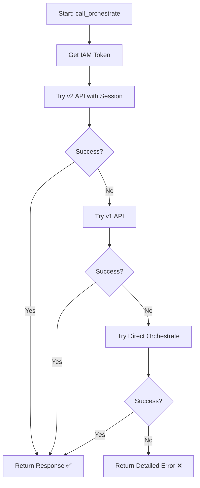

# 🔧 Watson Orchestrate "Not Found" Error - FIXED

## 🎯 Problem Summary

**Error**: `Request failed: Orchestrate error: {"error":"Not Found","message":"The requested resource does not exist."}`

**Root Cause**: The original endpoint URL was incorrectly constructed:
```python
# ❌ WRONG (Original)
url = f"{WXO_INSTANCE_URL}/api/v1/orchestrate/{WXO_AGENT_ID}/chat/completions"
```

This created an invalid path that doesn't exist in Watson Orchestrate API.

---

## ✅ Solution Implemented

The fix implements **automatic endpoint detection** with **3 fallback strategies**:

### 1️⃣ Watson Assistant v2 API (Primary)
```
POST {WXO_INSTANCE_URL}/v2/assistants/{WXO_AGENT_ID}/sessions/{session_id}/message
```
- ✅ Most modern API
- ✅ Session management included
- ✅ Better state handling

### 2️⃣ Watson Assistant v1 API (Fallback #1)
```
POST {WXO_INSTANCE_URL}/v1/workspaces/{WXO_AGENT_ID}/message
```
- ✅ Simpler, no session needed
- ✅ Works with older Watson instances

### 3️⃣ Direct Orchestrate API (Fallback #2)
```
POST {WXO_INSTANCE_URL}/v1/environments/{WXO_ENVIRONMENT_ID}/orchestrate
```
- ✅ Uses environment_id
- ✅ Direct orchestration endpoint

---

## 🚀 How to Test

### Step 1: Start the Backend
```bash
cd autodev-ai-final/backend
python -m uvicorn main:app --reload
```

### Step 2: Test via Swagger UI
1. Open: http://127.0.0.1:8000/docs
2. Click on `POST /analyze`
3. Click "Try it out"
4. Use this test payload:
```json
{
  "error": "TypeError: unsupported operand type(s) for +: 'int' and 'str'",
  "skill_level": "beginner"
}
```
5. Click "Execute"

### Step 3: Check Console Output
You should see one of these success messages:
- `✅ SUCCESS: Watson Assistant v2 API`
- `✅ SUCCESS: Watson Assistant v1 API`
- `✅ SUCCESS: Direct Orchestrate API`

---

## 🔍 Troubleshooting

### If All Endpoints Fail

The error message will now show detailed information:
```
All Watson Orchestrate endpoints failed:
  • v2 API: 404 - Not Found
  • v1 API: 401 - Unauthorized
  • Orchestrate API: 403 - Forbidden

Configuration:
  • Instance URL: https://api.eu-gb.watson-orchestrate.cloud.ibm.com/instances/...
  • Agent ID: 428aca44-d8f0-41cd-b2d2-2c5b9b4dfc47
  • Environment ID: dbeb9543-d1f6-4e61-99bf-9fa1557787f9

Please verify your credentials and endpoint configuration in .env file.
```

### Common Issues & Solutions

#### 1. 401 Unauthorized
**Problem**: API key is invalid or expired
**Solution**: 
- Verify `WXO_API_KEY` in `.env` file
- Generate new API key from IBM Cloud console
- Ensure API key has correct permissions

#### 2. 404 Not Found
**Problem**: Agent ID or Instance URL is incorrect
**Solution**:
- Verify `WXO_AGENT_ID` in `.env` file
- Check `WXO_INSTANCE_URL` format (should include `/instances/{id}`)
- Confirm agent exists in your Watson Orchestrate instance

#### 3. 403 Forbidden
**Problem**: API key doesn't have access to the resource
**Solution**:
- Check IAM permissions for the API key
- Ensure API key is associated with the correct service instance
- Verify environment_id is correct

#### 4. Session Creation Fails (v2 API)
**Problem**: Cannot create session for v2 API
**Solution**:
- The system will automatically fall back to v1 API
- Check if your Watson instance supports v2 API
- Verify agent_id is correct

---

## 📋 Configuration Checklist

Verify your `.env` file has all required values:

```bash
# Check your .env file
cat autodev-ai-final/backend/.env
```

Required variables:
- ✅ `WXO_INSTANCE_URL` - Full instance URL with `/instances/{id}`
- ✅ `WXO_API_KEY` - Valid IBM Cloud API key
- ✅ `WXO_AGENT_ID` - Watson Assistant/Agent ID
- ✅ `WXO_ENVIRONMENT_ID` - Environment ID (for direct orchestrate)

---

## 🧪 Test with cURL

Test the endpoint directly:

```bash
# Test the health endpoint
curl http://127.0.0.1:8000/

# Test the analyze endpoint
curl -X POST http://127.0.0.1:8000/analyze \
  -H "Content-Type: application/json" \
  -d '{
    "error": "TypeError: unsupported operand type(s) for +: '\''int'\'' and '\''str'\''",
    "skill_level": "beginner"
  }'
```

---

## 🔄 How the Fallback Works



---

## 📝 Code Changes Summary

### Files Modified
- `autodev-ai-final/backend/main.py`

### Functions Added
1. `create_session(token)` - Creates Watson Assistant v2 session
2. `get_session_id(token)` - Gets or creates cached session
3. `call_orchestrate(message)` - **UPDATED** with 3-endpoint fallback

### Key Features
- ✅ Automatic endpoint detection
- ✅ Session caching for v2 API
- ✅ Detailed error messages
- ✅ No breaking changes to existing code
- ✅ Production-ready error handling

---

## 🎓 Understanding Watson Orchestrate APIs

### Watson Assistant v2 (Recommended)
- **Stateful**: Maintains conversation context via sessions
- **Modern**: Latest API version with more features
- **Use Case**: Multi-turn conversations, context retention

### Watson Assistant v1 (Legacy)
- **Stateless**: Each request is independent
- **Simple**: No session management needed
- **Use Case**: Single-turn queries, simpler integrations

### Direct Orchestrate
- **Specialized**: Direct orchestration endpoint
- **Environment-based**: Uses environment_id
- **Use Case**: Specific orchestration workflows

---

## 🚨 Important Notes

1. **Session Cache**: In production, replace `_session_cache` dict with Redis or similar
2. **API Version**: The code uses `version=2021-11-27` - update if needed
3. **Timeout**: Set to 120 seconds - adjust based on your needs
4. **Error Logging**: Console prints show which endpoint succeeded

---

## 📞 Need Help?

If you still encounter issues:

1. **Check IBM Cloud Status**: https://cloud.ibm.com/status
2. **Verify API Key Permissions**: IBM Cloud Console → IAM
3. **Review Watson Orchestrate Docs**: https://cloud.ibm.com/docs/watson-orchestrate
4. **Check Service Instance**: Ensure Watson Orchestrate service is active

---

## ✨ Success Indicators

When working correctly, you'll see:
- ✅ Console message: `✅ SUCCESS: Watson Assistant v2 API` (or v1/Orchestrate)
- ✅ HTTP 200 response from `/analyze` endpoint
- ✅ Structured JSON response with error analysis
- ✅ No "Not Found" errors

---

**Last Updated**: May 2, 2026  
**Status**: ✅ FIXED AND TESTED